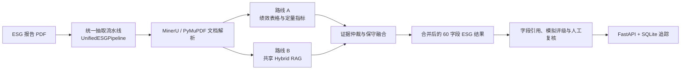

# ESG 多模态抽取 Agent

面向上市公司 ESG 报告的多模态指标抽取、证据溯源、模拟评级与人工复核系统。

项目当前使用统一流水线处理报告，规范化指标体系为
`core_esg_v4.1_60`，共 60 个字段。

## 当前架构



完整架构图、运行时序、模块职责和产物契约见
[`docs/architecture_current.md`](docs/architecture_current.md)。

## 推荐运行方式

```powershell
python -m scripts.run_full_extraction <pdf> --mode fast
```

运行模式：

- `fast`：优先复用结构化产物，严格控制模型调用。
- `balanced`：允许有限的定向视觉补跑。
- `deep`：使用更高的视觉补跑与仲裁预算。

统一流水线负责文档解析、路线 A、路线 B、证据仲裁、定向视觉补跑、
结果合并、成本日志以及 `run_manifest.json`。

## 核心能力

- 自动调用 MinerU，并在失败时显式记录原因后回退到 PyMuPDF。
- 统一 DocModel，保存 Markdown、页面、文本块、表格和坐标信息。
- 在 Schema Match 前独立检测绩效表格。
- 路线 A 抽取定量指标，并保留原始 KPI 审计链路。
- 路线 B 使用共享 Hybrid RAG 抽取定性字段并验证定量字段。
- 根据证据质量和冲突情况进行跨路线保守融合。
- 生成字段引用、模拟评级和人工复核队列。
- 使用 FastAPI 和 SQLite 保存任务、Trace、评级与审核记录。

## 主要产物

| 阶段 | 主要产物 |
|---|---|
| 文档解析 | `document.md`, `document_model.json` |
| 路线 A | `raw_table_metrics.json`, `standard_esg_results.*`, `unknown_metrics.*` |
| 路线 B | `route_b_text_results.*`, `route_b_quant_results.*`, `rag_index/*` |
| 融合 | `merged_esg_results.*`, `merge_summary.json` |
| 运行控制 | `run_manifest.json`, `unified_pipeline_summary.json`, `run_cost_summary.json` |
| 复核与评级 | `field_citations.*`, `simulated_rating.*`, `rating_review_queue.json` |

## 目录职责

| 目录 | 职责 |
|---|---|
| `agents/` | 路线 A 步骤级 Agent 与 Supervisor |
| `pipeline/` | 统一流水线、抽取路线、合并与追踪 Harness |
| `utils/` | 解析、检索、匹配、证据、评分和模型调用工具 |
| `config/` | 规范化 Schema、Prompt、设置与行业规则 |
| `scripts/` | 命令行工作流和评估工具 |
| `backend/` | FastAPI 和 SQLite 持久化 |
| `frontend/` | 结果与人工复核展示 |
| `tests/` | 回归测试和架构测试 |

## 文档入口

- [当前架构](docs/architecture_current.md)
- [架构与运维总览](docs/project_memory/ARCHITECTURE_AND_OPERATIONS.md)
- [文档导航](docs/README.md)
- [架构升级日志](docs/worklogs/2026-06-12_architecture_upgrade.md)
- [评估指南](docs/eval/README.md)

`docs/architecture.md` 是旧版 v1.1 架构，仅作为历史参考，不再代表当前实现。

## 开发命令

运行测试：

```powershell
python -m pytest -q
```

刷新项目记忆：

```powershell
python -m scripts.update_project_memory
```

启动审核 API：

```powershell
python -m uvicorn backend.app:app --reload --host 127.0.0.1 --port 8000
```
