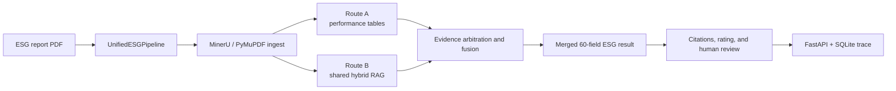

# ESG Multimodal Extraction Agent

A manifest-driven multimodal pipeline that extracts quantitative and
qualitative ESG indicators from corporate reports, preserves field-level
evidence, produces simulated ratings, and routes uncertain results to human
review.

The canonical schema is `core_esg_v4.1_60` with 60 fields.

## Current Architecture



Detailed diagrams, runtime sequence, artifact contracts, and component
ownership are documented in
[`docs/architecture_current.md`](docs/architecture_current.md).

## Canonical Workflow

```powershell
python -m scripts.run_full_extraction <pdf> --mode fast
```

Available modes:

- `fast`: controlled model use and maximum artifact reuse.
- `balanced`: limited targeted visual follow-up.
- `deep`: larger visual follow-up and arbitration budgets.

The unified pipeline owns ingest, Route A, Route B, evidence arbitration,
targeted visual follow-up, merge, cost logging, and `run_manifest.json`.

## Core Capabilities

- Configurable MinerU automatic ingestion with explicit PyMuPDF fallback.
- Unified DocModel with Markdown, page, block, table, and bounding-box artifacts.
- Deterministic performance-table detection before schema matching.
- Route A quantitative table extraction with a preserved raw KPI audit trail.
- Shared hybrid-RAG Route B for qualitative extraction and quantitative verification.
- Conservative cross-route fusion with evidence quality and conflict handling.
- Field citations, simulated rating, and human-in-the-loop review queues.
- FastAPI and SQLite task, trace, rating, and review persistence.

## Principal Artifacts

| Stage | Artifacts |
|---|---|
| Ingest | `document.md`, `document_model.json` |
| Route A | `raw_table_metrics.json`, `standard_esg_results.*`, `unknown_metrics.*` |
| Route B | `route_b_text_results.*`, `route_b_quant_results.*`, `rag_index/*` |
| Fusion | `merged_esg_results.*`, `merge_summary.json` |
| Run control | `run_manifest.json`, `unified_pipeline_summary.json`, `run_cost_summary.json` |
| Review | `field_citations.*`, `simulated_rating.*`, `rating_review_queue.json` |

## Repository Map

| Directory | Responsibility |
|---|---|
| `agents/` | Route A step agents and supervisor logic |
| `pipeline/` | Unified pipeline, extraction routes, merge, and tracking harnesses |
| `utils/` | Ingest, retrieval, matching, evidence, scoring, and model utilities |
| `config/` | Canonical schema, prompts, settings, and industry rules |
| `scripts/` | CLI workflows and evaluation utilities |
| `backend/` | FastAPI and SQLite persistence |
| `frontend/` | Result and review presentation |
| `tests/` | Regression and architecture tests |

## Documentation

- [Current architecture](docs/architecture_current.md)
- [Architecture and operations](docs/project_memory/ARCHITECTURE_AND_OPERATIONS.md)
- [Documentation guide](docs/README.md)
- [Architecture upgrade log](docs/worklogs/2026-06-12_architecture_upgrade.md)
- [Evaluation guide](docs/eval/README.md)

`docs/architecture.md` is retained as a historical v1.1 baseline and is no
longer the current architecture source of truth.

## Development

Run the test suite:

```powershell
python -m pytest -q
```

Refresh generated project memory:

```powershell
python -m scripts.update_project_memory
```

Start the review API:

```powershell
python -m uvicorn backend.app:app --reload --host 127.0.0.1 --port 8000
```
