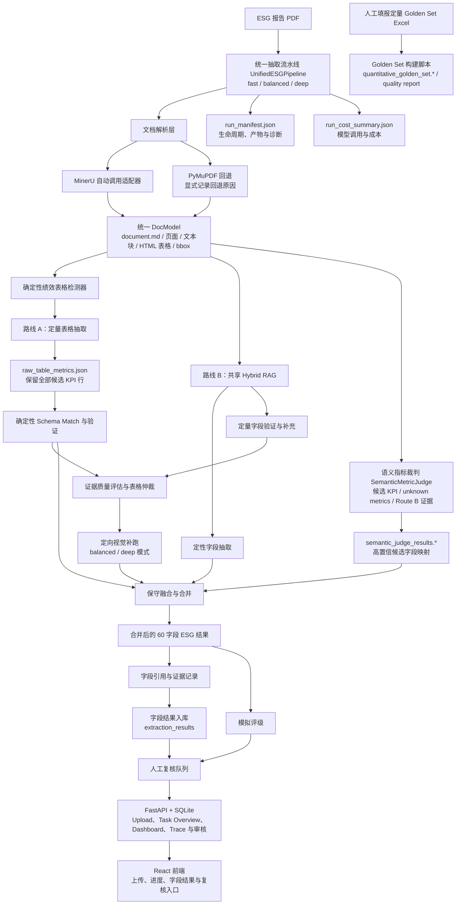
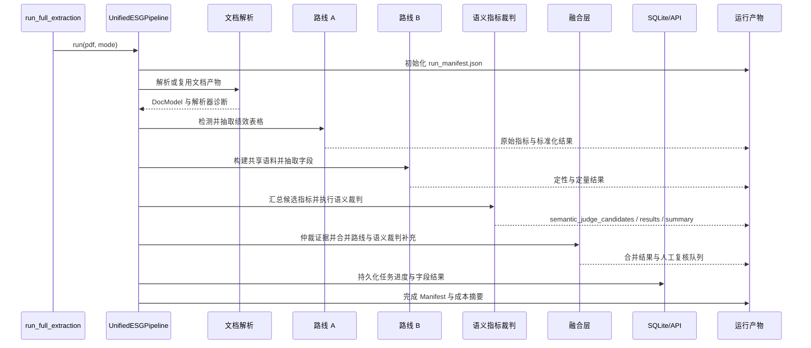

# 当前架构

本文档是当前 ESG 抽取系统架构的唯一事实来源。
规范化 Schema 为 `core_esg_v4.1_60`，共 60 个字段。

## 系统架构图



## 运行时序图



## 模块职责

| 模块 | 当前实现 | 职责 |
|---|---|---|
| 顶层编排 | `pipeline/unified_pipeline.py` | 管理标准运行生命周期、模式、Manifest、补跑与合并 |
| 文档解析 | `utils/pdf_ingest.py`、MinerU 适配器 | 选择解析器并生成可复用文档产物 |
| 路线 A | `pipeline/appendix_pipeline.py`、步骤级 Agent | 抽取定量表格行并将通过验证的行映射到 Schema |
| 路线 B | `pipeline/text_pipeline.py`、`pipeline/quant_text_pipeline.py` | 使用共享检索语料抽取定性字段并验证定量字段 |
| 语义指标裁判 | `utils/semantic_metric_judge.py` | 从表格候选、未知指标和 Route B 证据中生成候选项，调用轻量 LLM 裁判映射到 Schema，并复用 B2 定量校验 |
| 仲裁与证据 | 表格仲裁和证据工具 | 评估来源质量、保留溯源并识别冲突 |
| 合并 | `pipeline/merge_pipeline.py` | 执行保守来源选择，接收语义裁判补充缺失字段，并保留不确定结果 |
| 兼容 Harness | `pipeline/agent_harness.py` | 支持旧产物检查和可恢复包装流程 |
| 追踪、入库与复核 | `pipeline/rating_data_harness.py`、`backend/` | 保存任务、Trace、评级、字段抽取结果、进度状态和人工审核动作 |
| 前端工作台 | `frontend/src/App.tsx` | 上传报告、启动分析、展示任务阶段、字段结果摘要和复核入口 |
| 评测数据 | `scripts/build_quantitative_golden_set.py`、`docs/eval/` | 汇总人工填报的定量 Golden Set Excel，生成 CSV/JSON 和质量报告 |

## 标准入口

```powershell
python -m scripts.run_full_extraction <pdf> --mode fast
python -m scripts.run_full_extraction <pdf> --mode balanced
python -m scripts.run_full_extraction <pdf> --mode deep
```

- `fast`：优先复用结构化产物并控制模型调用。
- `balanced`：启用有限的定向视觉补跑。
- `deep`：允许更高的补跑与仲裁预算。

## 主要产物

| 阶段 | 主要产物 |
|---|---|
| 文档解析 | `document.md`, `document_model.json`、页面、文本块和表格产物 |
| 路线 A | `all_table_rows.json`, `raw_table_metrics.json`, `standard_esg_results.*`, `unknown_metrics.*` |
| 路线 B | `route_b_combined_chunks.json`, `route_b_text_results.*`, `route_b_quant_results.*`, `rag_index/*` |
| 语义指标裁判 | `semantic_judge_candidates.json`, `semantic_judge_results.*`, `semantic_judge_summary.json` |
| 证据与仲裁 | `evidence_records.json`, `evidence_summary.json`, `table_quality_assessments.json`, `visual_followup_queue.json` |
| 融合 | `merged_esg_results.*`, `merge_summary.json` |
| 运行控制 | `run_manifest.json`, `unified_pipeline_summary.json`, `run_cost_summary.json`, `run_call_events.json` |
| 复核与评级 | `field_citations.*`, `simulated_rating.*`, `rating_review_queue.json`, `rating_review_history.json` |
| 后端数据库 | SQLite `reports`, `tasks`, `task_traces`, `rating_runs`, `review_items`, `extraction_results` |
| 定量 Golden Set | `quantitative_golden_set.csv`, `quantitative_golden_set.json`, `quantitative_golden_set_quality.*` |

## 并行约束

路线 A 和路线 B 在文档解析后逻辑上相互独立，但当前默认不进行物理并行。
两条路线仍会向同一报告目录写入共享产物。要安全并行，需要先引入路线级临时目录，
再通过显式发布步骤合并产物。

## 历史文档

`docs/architecture.md` 描述旧版 v1.1 基线，仅保留作为历史参考。
新的实现与运维决策应以本文档和
`docs/project_memory/ARCHITECTURE_AND_OPERATIONS.md` 为准。
