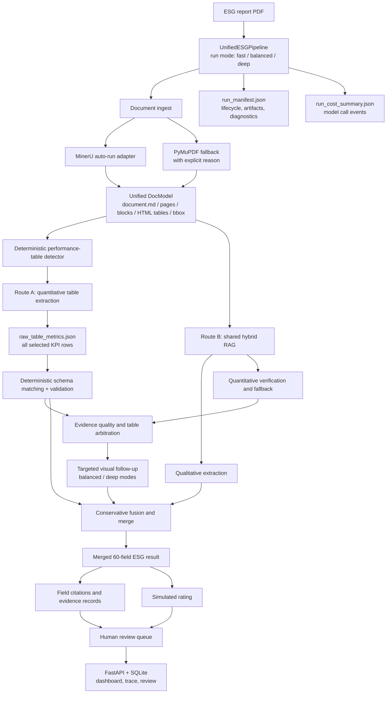
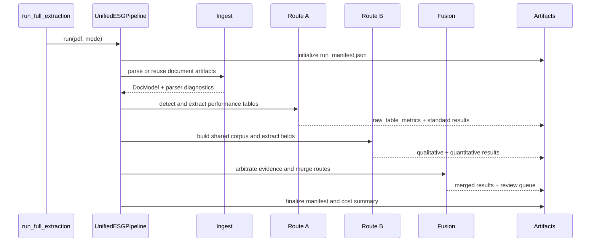

# Current Architecture

This document is the source of truth for the current ESG extraction architecture.
The canonical schema is `core_esg_v4.1_60` with 60 fields.

## System Architecture



## Runtime Sequence



## Ownership And Responsibilities

| Component | Current owner | Responsibility |
|---|---|---|
| Top-level orchestration | `pipeline/unified_pipeline.py` | Owns the canonical run lifecycle, modes, manifests, follow-up, and merge |
| Document ingest | `utils/pdf_ingest.py`, MinerU adapter | Selects parser and produces reusable document artifacts |
| Route A | `pipeline/appendix_pipeline.py`, step agents | Extracts quantitative table rows and maps validated rows to schema |
| Route B | `pipeline/text_pipeline.py`, `pipeline/quant_text_pipeline.py` | Uses one shared retrieval corpus for qualitative extraction and quantitative verification |
| Arbitration and evidence | table/evidence utilities | Scores source quality, preserves provenance, and identifies conflicts |
| Merge | `pipeline/merge_pipeline.py` | Applies conservative source selection and preserves uncertain cases |
| Compatibility harness | `pipeline/agent_harness.py` | Supports legacy artifact inspection and resumable wrapper workflows |
| Tracking and review | `pipeline/rating_data_harness.py`, `backend/` | Persists tasks, traces, ratings, and human review actions |

## Canonical Entry Point

```powershell
python -m scripts.run_full_extraction <pdf> --mode fast
python -m scripts.run_full_extraction <pdf> --mode balanced
python -m scripts.run_full_extraction <pdf> --mode deep
```

- `fast`: favors reusable structured artifacts and controlled model use.
- `balanced`: enables limited targeted visual follow-up.
- `deep`: allows the largest follow-up and arbitration budgets.

## Principal Artifacts

| Stage | Principal artifacts |
|---|---|
| Ingest | `document.md`, `document_model.json`, page/block/table artifacts |
| Route A | `all_table_rows.json`, `raw_table_metrics.json`, `standard_esg_results.*`, `unknown_metrics.*` |
| Route B | `route_b_combined_chunks.json`, `route_b_text_results.*`, `route_b_quant_results.*`, `rag_index/*` |
| Evidence and arbitration | `evidence_records.json`, `evidence_summary.json`, `table_quality_assessments.json`, `visual_followup_queue.json` |
| Fusion | `merged_esg_results.*`, `merge_summary.json` |
| Run control | `run_manifest.json`, `unified_pipeline_summary.json`, `run_cost_summary.json`, `run_call_events.json` |
| Review and rating | `field_citations.*`, `simulated_rating.*`, `rating_review_queue.json`, `rating_review_history.json` |

## Parallelism Constraint

Route A and Route B are logically independent after ingest, but physical
parallel execution remains disabled by default. Both routes currently write
shared report-directory artifacts. Safe concurrency requires route-local
staging directories followed by an explicit publish step.

## Historical Documents

`docs/architecture.md` describes the former v1.1 baseline and is retained only
for historical context. New implementation and operational decisions must use
this document and `docs/project_memory/ARCHITECTURE_AND_OPERATIONS.md`.
