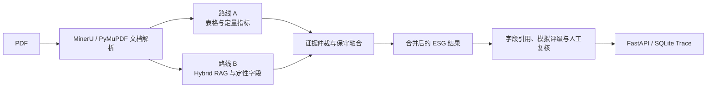

# 架构与运维总览

## 当前系统

项目使用统一、由 Manifest 驱动的 ESG 抽取流水线处理规范化 60 字段 Schema。
完整架构图和模块职责维护在
[`../architecture_current.md`](../architecture_current.md)。



## 推荐命令

运行标准抽取流程：

```powershell
python -m scripts.run_full_extraction <pdf> --mode fast
```

完成重要运行后刷新项目记忆：

```powershell
python -m scripts.update_project_memory
```

运行测试：

```powershell
python -m pytest -q
```

启动审核 API：

```powershell
python -m uvicorn backend.app:app --reload --host 127.0.0.1 --port 8000
```

## 运维规则

1. 将 `pipeline/unified_pipeline.py` 视为标准编排入口。
2. 将 `run_manifest.json` 视为单份报告的生命周期与产物索引。
3. 必须保留 `raw_table_metrics.json`，它是 Schema Match 前的原始表格指标审计链路。
4. 路线 B 定量结果只能作为验证、补充或安全回退，不能无条件覆盖路线 A。
5. 冲突与低置信度证据必须进入人工复核队列。
6. 在实现路线级临时目录前，不要对同一报告目录并行运行路线 A 和路线 B。
7. 不要向 Git 提交大型 `output/` 运行产物。

## 运行诊断

| 问题 | 检查文件 |
|---|---|
| 使用了哪个解析器，为什么？ | 文档解析元数据与 `run_manifest.json` |
| 路线 A 在 Schema Match 前识别了什么？ | `raw_table_metrics.json` |
| 某字段为什么被采用或拒绝？ | 验证、证据、仲裁与合并摘要 |
| 哪些模型调用消耗了预算？ | `run_call_events.json`, `run_cost_summary.json` |
| 哪些结果仍需人工复核？ | `rating_review_queue.json`, `human_review_queue.json` |
| 完整运行过程发生了什么？ | `unified_pipeline_summary.json`, `run_manifest.json` |

## 源码目录

| 目录 | 职责 |
|---|---|
| `agents/` | 路线 A 步骤级 Agent 与 Supervisor |
| `pipeline/` | 统一流水线、抽取路线、合并与追踪 Harness |
| `utils/` | 解析、检索、匹配、证据、评分、守卫与模型调用 |
| `config/` | Schema、Prompt、设置与行业适用性 |
| `scripts/` | 命令行工作流、评估、修复和分析 |
| `backend/` | FastAPI 接口与 SQLite 持久化 |
| `frontend/` | 结果与人工复核展示 |
| `tests/` | 架构、路线、合并、后端与评估回归测试 |

## 文档规则

- 当前架构：`docs/architecture_current.md`
- 当前运维：本文档
- 最新升级记录：`docs/worklogs/2026-06-12_architecture_upgrade.md`
- 自动生成的运行记忆：`docs/project_memory/latest_snapshot.json`、
  `LATEST_LOG.md` 和 `LATEST_RESULT.md`
- 旧版 v1.1 设计：`docs/architecture.md`，仅作为历史参考
