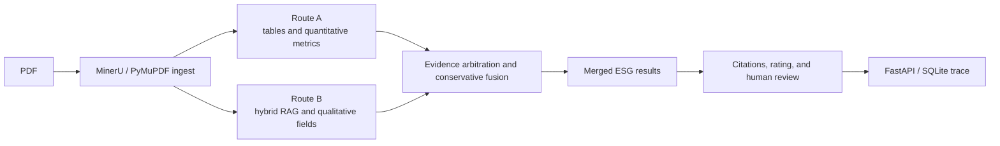

# Architecture And Operations

## Current System

The project runs a unified, manifest-driven ESG extraction pipeline over the
canonical 60-field schema. The architecture diagram and component ownership
are maintained in [`../architecture_current.md`](../architecture_current.md).



## Recommended Commands

Run the canonical extraction workflow:

```powershell
python -m scripts.run_full_extraction <pdf> --mode fast
```

Refresh project memory after a meaningful run:

```powershell
python -m scripts.update_project_memory
```

Run tests:

```powershell
python -m pytest -q
```

Start the review API:

```powershell
python -m uvicorn backend.app:app --reload --host 127.0.0.1 --port 8000
```

## Operational Rules

1. Treat `pipeline/unified_pipeline.py` as the canonical orchestration owner.
2. Treat `run_manifest.json` as the lifecycle and artifact index for a report.
3. Preserve `raw_table_metrics.json`; it is the pre-schema audit trail for
   selected performance-table rows.
4. Use Route B quantitative results as verified supplement or fallback, not an
   unconditional replacement for Route A.
5. Keep conflicts and low-confidence evidence in the review queue.
6. Do not run Route A and Route B concurrently against the same report
   directory until route-local staging is implemented.
7. Do not commit large generated `output/` artifacts to Git.

## Run Diagnostics

| Question | Inspect |
|---|---|
| Which parser was used and why? | ingest metadata and `run_manifest.json` |
| What did Route A see before schema matching? | `raw_table_metrics.json` |
| Why was a field selected or rejected? | validation, evidence, arbitration, and merge summaries |
| Which model calls consumed budget? | `run_call_events.json`, `run_cost_summary.json` |
| What still needs review? | `rating_review_queue.json`, `human_review_queue.json` |
| What happened across the full run? | `unified_pipeline_summary.json`, `run_manifest.json` |

## Source Map

| Directory | Responsibility |
|---|---|
| `agents/` | Route A step agents and supervisor logic |
| `pipeline/` | Unified pipeline, extraction routes, merge, and tracking harnesses |
| `utils/` | Ingest, retrieval, matching, evidence, scoring, guards, and model calls |
| `config/` | Canonical schema, prompts, settings, and industry applicability |
| `scripts/` | CLI workflows, evaluation, repair, and analysis |
| `backend/` | FastAPI endpoints and SQLite persistence |
| `frontend/` | Result and review presentation |
| `tests/` | Architecture, route, merge, backend, and evaluation regression tests |

## Documentation Policy

- Current architecture: `docs/architecture_current.md`
- Current operations: this file
- Latest implementation change log: `docs/worklogs/2026-06-12_architecture_upgrade.md`
- Generated run memory: `docs/project_memory/latest_snapshot.json`,
  `LATEST_LOG.md`, and `LATEST_RESULT.md`
- Former v1.1 design: `docs/architecture.md` (historical only)
